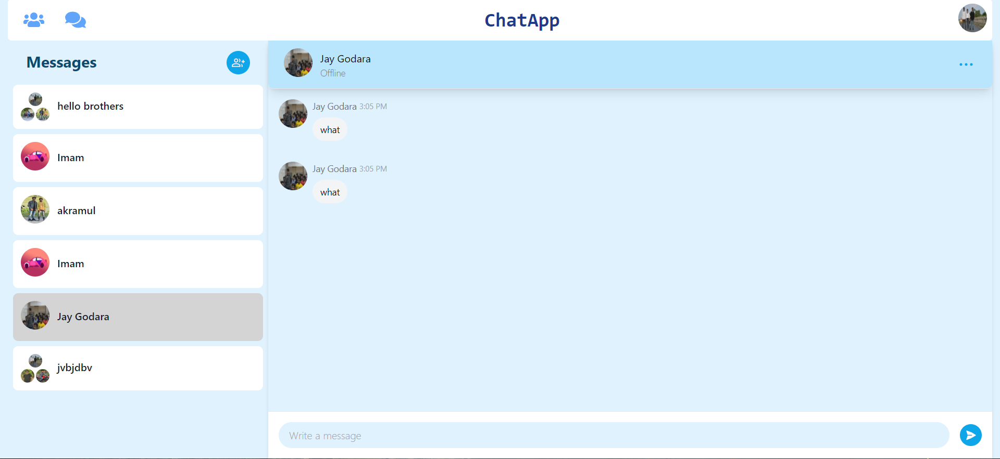
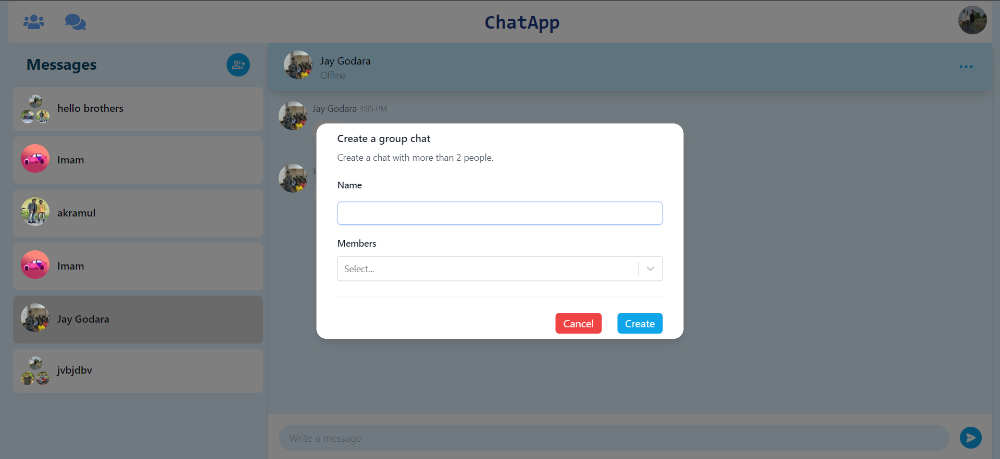
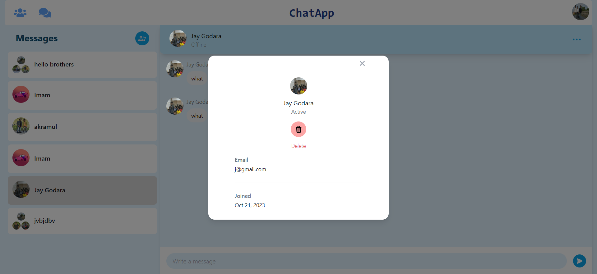

Chat App README
This chat application is built using Next.js for both the frontend and backend, complemented with Tailwind for styling and Pusher for real-time chat functionality.

Libraries and Their Purpose:

Core Libraries:
Next.js (13.5.6): Enables server-side rendering and generates static websites for React-based web applications.
React (18) & React-DOM (18): Libraries for building user interfaces; React-DOM renders React components in the browser.
Tailwind: A utility-first CSS framework for rapid custom designs.
Pusher (5.1.3) & Pusher-js (8.3.0): Facilitates real-time bidirectional communication between servers and clients.
Data & Authentication:
@prisma/client (5.4.2): Provides a type-safe database client for accessing data with Prisma.
@auth/prisma-adapter (1.0.4): An adapter to integrate Prisma with NextAuth.
Next-auth (4.24.3): Adds authentication capabilities for Next.js apps.
bcrypt (5.1.1): Used for password hashing.

Utility & Helpers:
lodash (4.17.21): A versatile utility library.
date-fns (2.30.0): Handy for formatting and manipulating dates.
axios (1.5.1): Promise-driven HTTP client.
zustand (4.4.3): A minimal state-management solution.

UI & Components:
@headlessui/react (1.7.17): Provides unstyled, fully accessible UI components for React.
react-hook-form (7.47.0): Efficiently handles forms with easy-to-use validation.
react-hot-toast (2.4.1): Offers user notifications/toasts.
react-icons (4.11.0): A convenient way to include only the icons you need.
react-select (5.7.7): A customizable select control.

Media:
next-cloudinary (4.27.0): Makes working with Cloudinary in Next.js smoother.

Features:
Real-time communication between users.
Group chat functionality:
Create groups.
Delete groups.
User authentication system.

.png)
.png)
.png)
.png)

Setup:
Prerequisites:
Install Node.js (v14 or newer) and npm.
Set up a Prisma database and retrieve the connection strings.
Acquire API keys from a Pusher account setup.
If using Cloudinary, ensure you've set up an account and have the necessary credentials.

Installation:
Clone the repository:

git clone [Your Repository URL]
cd [Your Repository Directory]

Install dependencies:

npm install
Environment Configuration: Rename .env.example to .env.local and input the required variables:

PUSHER_APP_ID, PUSHER_KEY, PUSHER_SECRET, PUSHER_CLUSTER
PRISMA_DATABASE_URL
CLOUDINARY_URL (if using Cloudinary)

Run Prisma migrations (if any):

npx prisma migrate dev

Launch the development server:

npm run dev

Head over to http://localhost:3000 in your browser to explore the app.

